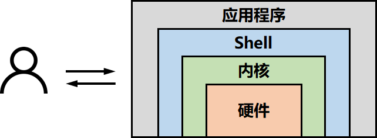

# 01. 关于Ubuntu

## Ubuntu与Windows的比较

* 优点
  
  * 优良的稳定性和安全性（直观感受更流畅，cpu、网络、内存、IO等资源调度更合理）
  * 良好的可移植性及灵活性（部署项目代码更方便）
  * 支持几乎所有的网络协议及开发语言
  * 良好的包管理 dpkg 、apt
  * 具有非常好的开源特性（系统及工具软件免费）
  
* 缺点
  * 驱动数量
  * 相关软件
  * **你不熟悉**
  
* ~~我们有了WSL，适用于 Linux 的 Windows 子系统，相对于虚拟机消耗的资源更少~~

* Ubuntu是基于Debian以桌面应用为主的Linux发行版，为一般使用者预先整合好的Linux系统及各种应用
  * linux：一般指GNU套件+linux内核 GNU: GNU is Not Unix
    
    * 应用程序、文件系统、Shell、内核（进程管理、内存管理、文件系统管理、设备管理和网络管理）
    
    <p align="center"><br></p>
    
  * 遇到问题怎么办：
  
    * 尝试理解深入一点，遇到自己不熟悉不懂的东西非常正常，尽量不用baidu，少用csdn，尝试用英文表达问题进行搜索
    * 乐于折腾

## 0.安装（virtualbox6.1 ubuntu18.04.6）

* 英文版、minimal installation、不升级、自动分区（如果是双系统将引导写入ubuntu自己的分区头可以手动，写入总硬盘头可能需要修正win引导）

* 更换源 mirrors.zju.edu.cn

## 1.什么是shell （运行在终端中的文本互动程序，命令解释器）

* 人和计算机的交互：Windows的图形用户界面GUI，Ubuntu的文本交互方式

* [bash](https://www.gnu.org/software/bash/)是啥，与sh的关系？ bash 是目前使用最广泛的shell， /bin/sh 本是 bash的符号链接，但鉴于 bash 过于复杂，有人把 ash 从 NetBSD 移植到 Linux 并更名为 dash，并建议将 /bin/sh 指向它，以获得更快的脚本执行速度。

* ctrl+alt+t的terminal是什么？ 一个在窗口中绘制文本的应用程序，将命令发给shell

* 语言本身的功能与执行速度？  shell 也是一种解释型语言（脚本语言），效率不如编译型语言

* 基本命令 (多用tab)
  
  ```bash
  cd/ls/pwd
  mkdir/rm/mv/cp/touch
  cat
  ###################################
  clear
  ln
  diff
  grep
  export/alias
  which/whereis
  ldd/ldconfig
  whoami
  uname
  man ...
  ps
  kill/pkill
  wget python -m http.server 
  env
  df/free/top
  find
  ##################################
  ssh/scp/ssh-keygen
  who
  ```
  
  特殊的环境变量PATH/`env`/.bashrc

## 2.文件系统

* “/”作为根节点的树状结构

* 区分大小写

* 链接指令ln -s

## 3.文本处理

* 重定向
  
  * command < filein
  * command > fileout
  * command >> file
* 0stdin 1stdout 2stderr
  
* *grep/sed/awk*

* 管道  符号 `|`  可以将多个命令串联起来，每一个进程的 stdout 作为下一个进程的 stdin

  `cat file | sort | uniq | wc -l`  对 file 中的内容进行排序、去重、并统计行数。

## 4.包管理（apt apt-get apt-cache）

* 源（官方、ROS、自添加）

* apt

* apt search  搜索软件包描述

* apt show ${package_name}  显示软件包细节

* apt-file list ${package_name}  列出包内的所有文件

* manual install （apt install gdebi）

* 与c++相关的 vcpkg conan 

## 5.用户、用户组、权限

* 每个文件拥有三组权限，对应所有者、所属组、其他人

* chmod chown 777

* 关于sudo

## 6.其他

* 你可能需要了解一下的其他工具
  
  * **git**
  
  * vim/nano

* 如何手动安装一些库（configure & make & make install)

* 串口支持
  
  * 手动修改延时
  * 添加权限

* supervisor + python -m http.server （进程管理工具）

* Typora/WPS/GIMP/Blender/Albert -> wox alfred （提高效率）

* unity tweak tool

* NVIDIA-driver
  
  * 直接用CUDA包进行安装
  * 根据报错进行对应操作
    * 最新的cuda包已经可以自动拉nouveau黑名单了/var/log/cuda-installer.log/nvidia-driver-installer.log 
    * 关闭gdm `service gdm stop`

* ~~WSL使用体验~~

## 7.自动化你的日常

* 尝试批量将上课用的ppt转换成pdf（libreoffice）

* 命令行批量处理pdf （pdftk）

* 批量重命名（bash）

* 图片转换格式，批量缩放（ImageMagick）

* （windows里面使用winR开软件）

---

# 关于python通信

需要实现的功能：

* 进程A发送字符串到进程B
* 进程B接受进程A的数据，并显示在屏幕上

推荐使用python库:

* 操作、监控鼠标和键盘的 pynput
* 提供网络通信接口的 socket（python 标准库）

```python
pip install pynput
```


> 关于python的版本
>
> * ubuntu18.04及之前推荐python2
>
> * ubuntu20.04推荐python3
>
> pip是什么
>
> * 包管理
>
> * 若env中同时包含Python2&3，一定注意使用pip与python对应
>
> 执行python程序
>
> * `#!/usr/bin/env python`
>* `chmod +x xxx.py`


