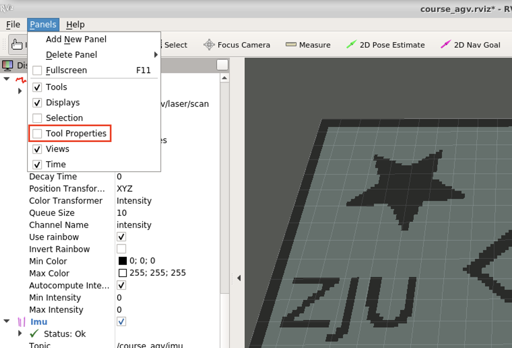

# 07.planner in ROS

```bash
└── course_agv_nav
    ├── CMakeLists.txt
    ├── config
    ├── launch
    │   ├── nav.launch
    │   └── nav.rviz
    ├── msg
    ├── package.xml
    ├── scripts
    │   ├── global_planner.py
    │   ├── a_star.py # TODO
    │   ├── local_planner.py
    │   └── dwa.py # TODO
    └── srv
        └── Plan.srv
```

## map

`course_agv_gazebo/config/map.yaml`

```yaml
image: map/map.png
resolution: 0.155 # meters/pixel
origin: [-10.0, -10.0, 0.0] # 2D pose of lower-left pixel (x,y,yaw)
occupied_thresh: 0.65
free_thresh: 0.196
negate: 1 # Whether the white/black free/occupied semantics should be reversed
```

`course_agv_gazebo/models/ground_plane_for_agv/model.sdf`

```xml
<heightmap>
    <uri>model://ground_plane_for_agv/map/map.png</uri>
    <size>20 20 0.4</size>
    <pos>0 0 0.01</pos>
</heightmap>
```

# global_planner.py

```python
self.tf = tf.TransformListener()
self.goal_sub = rospy.Subscriber('/course_agv/goal',PoseStamped,self.goalCallback)
self.plan_srv = rospy.Service('/course_agv/global_plan',Plan,self.replan)
self.path_pub = rospy.Publisher('/course_agv/global_path',Path,queue_size = 1)
self.updateMap()
```

# local_planner.py

```python
self.path = Path()
self.tf = tf.TransformListener()
self.path_sub = rospy.Subscriber('/course_agv/global_path',Path,self.pathCallback)
self.vel_pub = rospy.Publisher('/course_agv/velocity',Twist, queue_size=1)
self.midpose_pub = rospy.Publisher('/course_agv/mid_goal',PoseStamped,queue_size=1)
self.laser_sub = rospy.Subscriber('/course_agv/laser/scan',LaserScan,self.laserCallback)
self.planner_thread = None
self.need_exit = False
```

# Prepare python scripts

- Put **robot_tf.py** to `07/course_agv_gazebo/scripts/`
- Put **kinematics.py** to `07/course_agv_control/scripts/`

# Change topic of 2D Nav Goal rviz

**Open Tool Properties in Panels**

<p align="center"><br></p>
**Change Topic of 2D Nav Goal**

<p align="center"><br></p>

# Testing Pipeline

```
roslaunch course_agv_gazebo course_agv_world.launch
roslaunch course_agv_gazebo course_agv_world_rviz.launch
python xxx/course_agv_nav/scripts/global_planner.py
```

