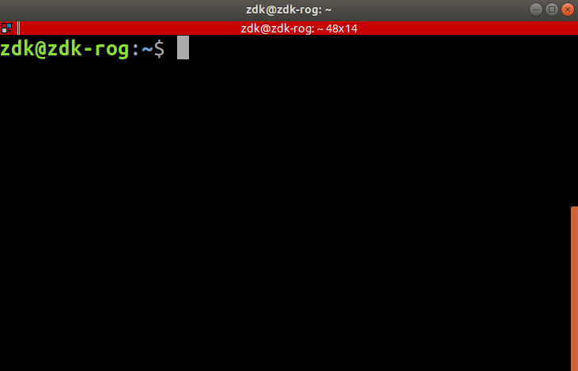
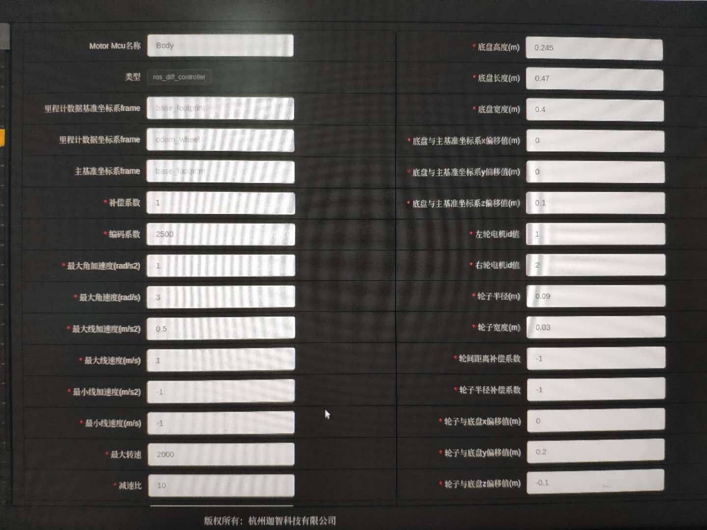

# 实物实验Tutorial

## Table of Content

- 连接机器人
- 建图&定位
- 收发消息
- Global Planner & Local Planner
- 其他注意事项

## 连接机器人

1. 修改自己笔记本的IP地址，设为Manual，Address：192.168.1.1，Netmask：255.255.255.0，Gateway：192.168.1.1
- 打开设置，选择“网络”

2. 网线连接自己的笔记本和机器人，终端ssh进去，ssh成功则说明网络层面上连接机器人成功

   ```bash
   $ ssh jz@192.168.1.3
   ```

   密码：robot123

3. 在ssh界面修改机器人上的`/etc/hosts`文件，加入自己的笔记本的IP和机器名（同一个IP不能有多个机器名），下图为用户名与机器名的区分：

   <p align="center"><br><em>@前的zdk为用户名，@后的zdk-rog为机器名</em></p>

   ```
   127.0.0.1      localhost
   127.0.1.1      jzrobot-x
   192.168.1.1    zdk-laptop
   ```

4. 修改自己的笔记本的`/etc/hosts`文件，加入机器人的IP和机器名，**例如**

   ```
   127.0.0.1		localhost
   127.0.1.1		zdk-laptop
   192.168.1.3 	jzrobot-x
   ```

5. 修改自己的笔记本的`~/.bashrc`文件，在最后一行加入以下命令，然后source (`source ~/.bashrc`)

   ```bash
   export ROS_MASTER_URI=http://192.168.1.3:11311
   export ROS_IP=192.168.1.1
   ```


6. (如果已有，可以跳过此步骤) 修改机器人的`~/.bashrc`文件，在最后一行加入以下命令，然后重启机器人 (在终端中ssh连接机器人，然后sudo reboot)

   ```bash
   export ROS_MASTER_URI=http://192.168.1.3:11311
   export ROS_IP=192.168.1.3
   ```


7. 在自己的笔记本查看机器人上的topic与node，如果能输出topic的信息则说明ROS层面上连接成功

   ```bash
   $ rostopic list
   $ rosnode info /move_base  ### 查看最后一行是否error
   ```

## 建图 & 定位

1. 在机器人上标定IMU，在ssh的界面上输入以下命令（标定好就结束了）

```bash
$ rosrun calib_imu imu_calib
```

2. 在机器人上转发激光雷达的数据，在ssh的界面上输入以下命令（这个会一直跑  ，后面需要再开个ssh）

```bash
# 注意，以下命令二选一
$ rosrun topic_tools relay /scan /scan_emma_nav_front   ### 老车
$ rosrun topic_tools relay /scan_emma_nav_front /scan   ### 新车
```

3. 打开urg节点，在ssh的界面上输入以下命令 (仅老车需要)

```bash
$ rosrun urg_node urg_node
```

4. 打开tf转发工具，在ssh的界面上输入以下命令（这个会一直跑，后面需要再开个ssh）

```bash
$ cd jz/catkin_ws
$ source devel/setup.bash
$ rosrun my_tf tf_broadcaster
```

5. 建图 (如果之前没有建过图或者建图效果太差需要重建，则完成这一步骤，否则跳过。)

- 5.1 首先在ssh的界面打开cartographer_occupancy_grid_node这个节点

```bash
$ rosrun cartographer_ros cartographer_occupancy_grid_node
```

- 5.2 然后打开网页（192.168.1.3），在网页上操作建图（首先点击右上角登录，密码：admin）

  - 新建地图
  - 使用键盘WASD键控制小车移动，尽量覆盖整个场地
  - 网页上白色区域表示可行区域，黑色部分表示障碍物，红色表示激光雷达数据，注意要跟实物匹配

建好之后千万不要在网页中勾选保存！！！首先使用map_server存储建好的地图:

```bash
$ rosrun map_server map_saver -f mymap map:=/map
```

然后确认保存好的地图是否正确，最后在网页勾选保存

- 5.3 关闭5.1中打开的节点

6. 建好图后，在网页中启动导航模式并手动定位

7. 在ssh界面启动map_server，之后就可以通过/map 这个topic来读取地图

```bash
$ rosrun map_server map_server mymap.yaml
```


## 收发消息

| 仿真topic/tf            | 真机topic / tf           | 类型                                                         | 作用                    |
| ----------------------- | ------------------------ | ------------------------------------------------------------ | ----------------------- |
| /map                    | /map                     | [nav_msgs](http://docs.ros.org/api/nav_msgs/html/index-msg.html)/OccupancyGrid | 接收地图信息(障碍物)    |
| /course_agv/laser/scan  | /scan                    | [sensor_msgs](http://docs.ros.org/melodic/api/sensor_msgs/html/index-msg.html)/LaserScan | 接收激光雷达信息        |
| /course_agv/velocity    | /webService/cmd_vel      | [geometry_msgs](https://docs.ros.org/api/geometry_msgs/html/index-msg.html)/Twist | 发送AGV的速度信息       |
| /course_agv/global_path | /course_agv/global_path  | [nav_msgs](http://docs.ros.org/melodic/api/nav_msgs/html/index-msg.html)/Path | 发送GlobalPlanner的路径 |
| /course_agv/goal        | /course_agv/goal         | [geometry_msgs](http://docs.ros.org/melodic/api/geometry_msgs/html/index-msg.html)/PoseStamped | 获取rviz上的target信息  |
| /map <-> /robot_base    | /map <-> /base_footprint | [tf](http://wiki.ros.org/tf/Tutorials/Writing%20a%20tf%20listener%20%28Python%29) | MAP坐标系 <-> AGV坐标系 |

**接受数据**

- subscribe对应的topic即可

**发送指令**

- 只需要往`/webService/cmd_vel`这个topic发送`geometry_msgs/Twist`即可

## Global Planner & Local Planner

**启动launch文件**

启动course_agv_nav下的nav_real.launch


**Global Planner**

需要改的几处

- 代码第52行的tf

```python
改之前
self.tf.waitForTransform("/map", "/robot_base", rospy.Time(), rospy.Duration(4.0))
(self.trans,self.rot) = self.tf.lookupTransform('/map','/robot_base',rospy.Time(0))

改之后
self.tf.waitForTransform("/map", "/base_footprint", rospy.Time(), rospy.Duration(4.0))
(self.trans,self.rot) = self.tf.lookupTransform('/map','/base_footprint',rospy.Time(0))
```

- 代码第32行的map subscriber

```python
改之前
self.map_sub = rospy.Subscriber('/slam_map',OccupancyGrid,self.mapCallback)

改之后
self.map_sub = rospy.Subscriber('/map',OccupancyGrid,self.mapCallback)
```

- import自己的AStarPlanner，初始化AStarPlanner，调用plan函数进行路径规划

**Local Planner**

- Local Planner由Global Planner触发，即Local Planner监听Global Planner生成的全局路径（通过ROS的订阅topic机制实现）。

- 在获取全局路径后，Local PLanner结合全局路径、机器人当前位姿与地图，调用DWA，生成线速度与角速度，最后将该指令通过发布`/webService/cmd_vel`控制机器人移动。
- 上述步骤按照固定频率循环执行。

## 其他注意事项

- 机器人速度不能超过0.2m/s，不然容易出事:warning:

- 注意观察机器人左上角的急停按钮，发生突发情况可以按急停按钮

- 机器人参数：
   <p align="center"><br></p>


