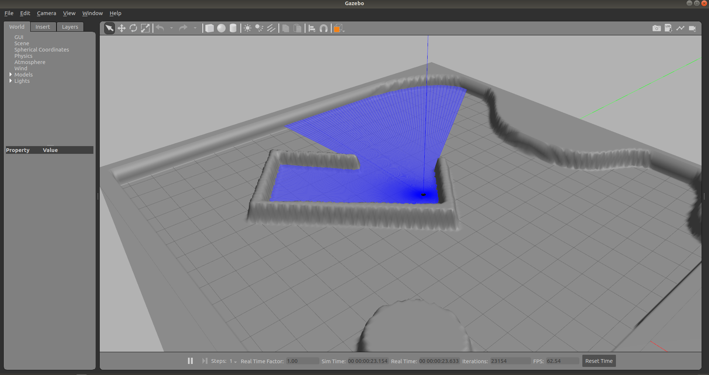
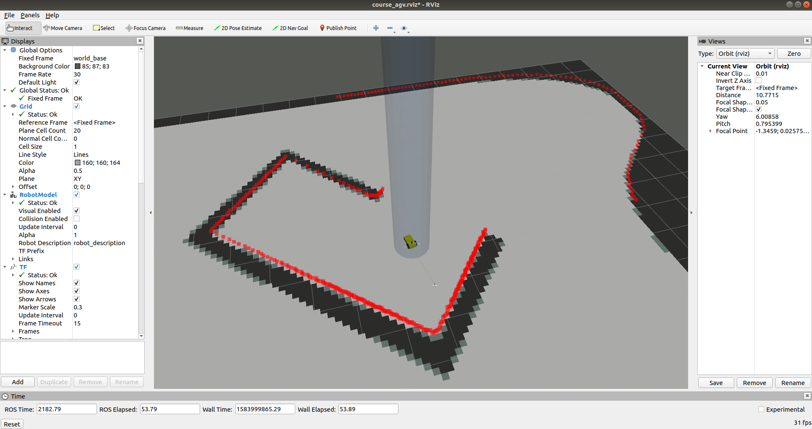

# course_agv source

```bash
src
├── course_agv_control
│   ├── CMakeLists.txt
│   ├── config
│   │   └── course_agv_control.yaml
│   ├── launch
│   │   └── course_agv_control.launch
│   ├── package.xml
│   └── scripts
│       ├── keyboard_velocity.py # 使用键盘发送local velocity
│       └── kinematics.py # 接收local velocity 转换成两轮速度
├── course_agv_description
│   ├── CMakeLists.txt
│   ├── launch
│   │   ├── course_agv.rviz
│   │   └── course_agv_rviz.launch
│   ├── meshes
│   │   └── hokuyo.dae
│   ├── package.xml
│   └── urdf
│       ├── course_agv.gazebo
│       ├── course_agv.xacro
│       └── materials.xacro
├── course_agv_gazebo
│   ├── CMakeLists.txt
│   ├── config
│   │   ├── map -> ../models/ground_plane_for_agv/map
│   │   └── map.yaml
│   ├── launch
│   │   ├── course_agv.rviz
│   │   ├── course_agv_world.launch
│   │   └── course_agv_world_rviz.launch
│   ├── models
│   │   └── ground_plane_for_agv
│   │       ├── map
│   │       │   ├── map2.png
│   │       │   └── map.png
│   │       ├── materials
│   │       │   └── textures
│   │       │       ├── flat_normal.png
│   │       │       └── grey.png
│   │       ├── model.config
│   │       └── model.sdf
│   ├── package.xml
│   ├── scripts
│   │   └── robot_tf.py
│   └── worlds
│       └── course_agv.world
└── README.md

```

* 编译
  * 安装python-catkin-tools
  * catkin build进行编译
* 运行gazebo
  * `roslaunch course_agv_gazebo course_agv_world.launch`
  * sensors包含了imu以及2d laser



* 查看效果
  * 在gazebo开启的情况下运行`roslaunch course_agv_gazebo course_agv_world_rviz.launch`

